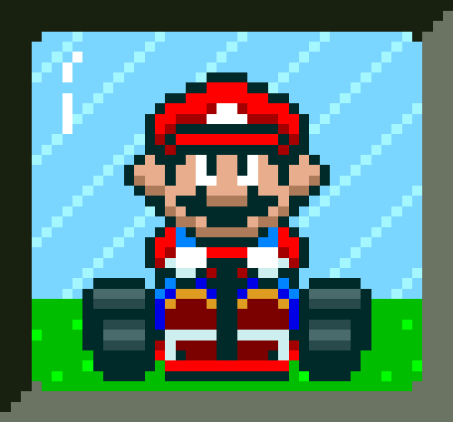
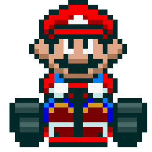

<h1>Desafio de projeto do Felipão: Mario Kart.JS</h1>

  <table>
        <tr>
            <td>
                
            </td>
            <td>
                <b>Objetivo:</b>
                
Mario Kart é uma série de jogos de corrida desenvolvida e publicada pela Nintendo. Nosso desafio será criar uma lógica de um jogo de vídeo game para simular corridas de Mario Kart, levando em consideração as regras e mecânicas abaixo.

            </td>
        </tr>
    </table>

<h2>Players</h2>
      <table style="border-collapse: collapse; width: 800px; margin: 0 auto;">
        <tr>
            <td style="border: 1px solid black; text-align: center;">
                
Mario

                
            </td>
            <td style="border: 1px solid black; text-align: center;">
                
Velocidade: 4

                
Manobrabilidade: 3

                
Poder: 3

            </td>
             <td style="border: 1px solid black; text-align: center;">
                
Peach

                
            </td>
            <td style="border: 1px solid black; text-align: center;">
                
Velocidade: 3

                
Manobrabilidade: 4

                
Poder: 2

            </td>
              <td style="border: 1px solid black; text-align: center;">
                
Yoshi

                
            </td>
            <td style="border: 1px solid black; text-align: center;">
                
Velocidade: 2

                
Manobrabilidade: 4

                
Poder: 3

            </td>
        </tr>
        <tr>
            <td style="border: 1px solid black; text-align: center;">
                
Bowser

                
            </td>
            <td style="border: 1px solid black; text-align: center;">
                
Velocidade: 5

                
Manobrabilidade: 2

                
Poder: 5

            </td>
            <td style="border: 1px solid black; text-align: center;">
                
Luigi

                
            </td>
            <td style="border: 1px solid black; text-align: center;">
                
Velocidade: 3

                
Manobrabilidade: 4

                
Poder: 4

            </td>
            <td style="border: 1px solid black; text-align: center;">
                
Donkey Kong

                
            </td>
            <td style="border: 1px solid black; text-align: center;">
                
Velocidade: 2

                
Manobrabilidade: 2

                
Poder: 5

            </td>
        </tr>
    </table>

Este projeto é um simulador de corridas do Mario Kart executado inteiramente no terminal, desenvolvido em **Node.js**.

## 📌 Sobre o Projeto e Créditos

Este projeto nasceu como parte do desafio do curso **Formação Node.js Fundamentals da DIO**

* **Nota Histórica:** O código original e estruturalmente básico do desafio está preservado no arquivo `old_index.js` para fins de comparação didática.

* **Evolução** Esta versão atual (no diretório `src/`) evoluiu para uma arquitetura orientada a objetos, e com muitas lógicas implementadas para enriquecer o simulador.

* **A interface visual no terminal foi construída com o auxílio de Inteligência Artificial**, para garantir uma experiência de log muito mais imersiva e legível.

---

## ✨ Principais Funcionalidades

* 🎮 **3 Modos de Jogo**:
  
  * ⚡ **Modo Rápido**: Computa a corrida instantaneamente e exibe o pódio.
    
  * 📊 **Modo Detalhado**: Acompanhe a corrida rodada a rodada. Veja cada jogador avançar, escorregar em cascas de banana ou fazer *drifts* em
  * curvas perigosas, com direito a um **minimapa visual** `[---🚗------🏆]`.
    
  * 🤖 **Modo Torneio (Auto)**: Ferramenta de análise de dados. Simula dezenas ou centenas de corridas silenciosamente em milissegundos e gera um relatório estatístico de *Win Rate* e *Distância Total* de cada Player.
    
* 👥 **Modo Grand Prix (Até 6 Carros)**: Corra no modo 1x1 ou enfrente um grid completo de Bots controlados pelo computador (até 6 personagens).
  
* 🍄 **Sistema de Itens e Colisões**: Sistema de inventário onde caixas surpresas dão itens. Estrelas para invencibilidade, atire Cascos de Tartaruga em quem está na frente, ou deixe Bananas físicas na pista que param quem vier atrás!

---

## 🏁 Como Executar na Sua Máquina

**Pré-requisitos:** Você precisa ter o [Node.js](https://nodejs.org/) instalado na sua máquina.

1. **Clone este repositório:**
   git clone https://github.com/El3ci0Sz/Simulador-de-Mario-Kart.git
   
2. Navegue até a pasta do projeto:
  cd Simulador-de-Mario-Kart
  
3. Execute o codigo principal:
  node src/index.js

3.1 Execute a versão inicial do codigo:
  node src/old_index.js
